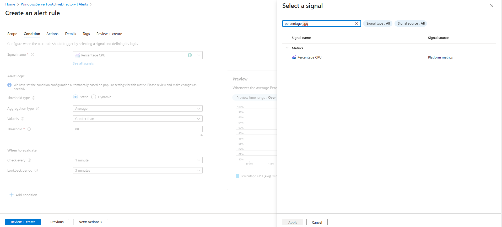
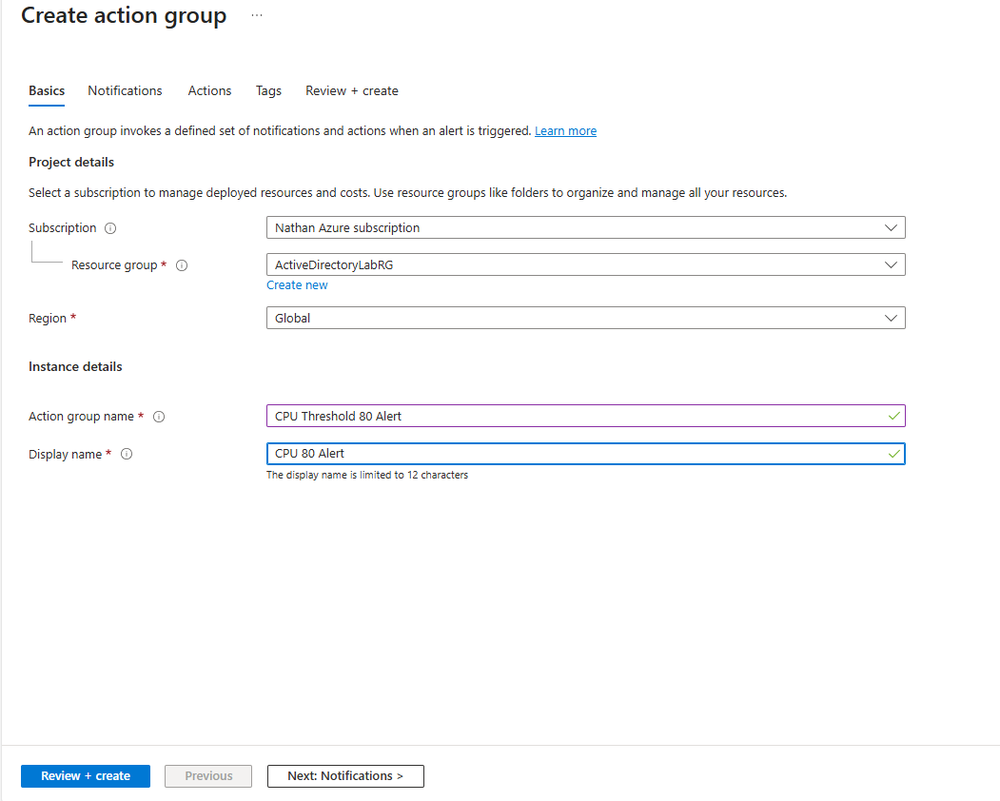
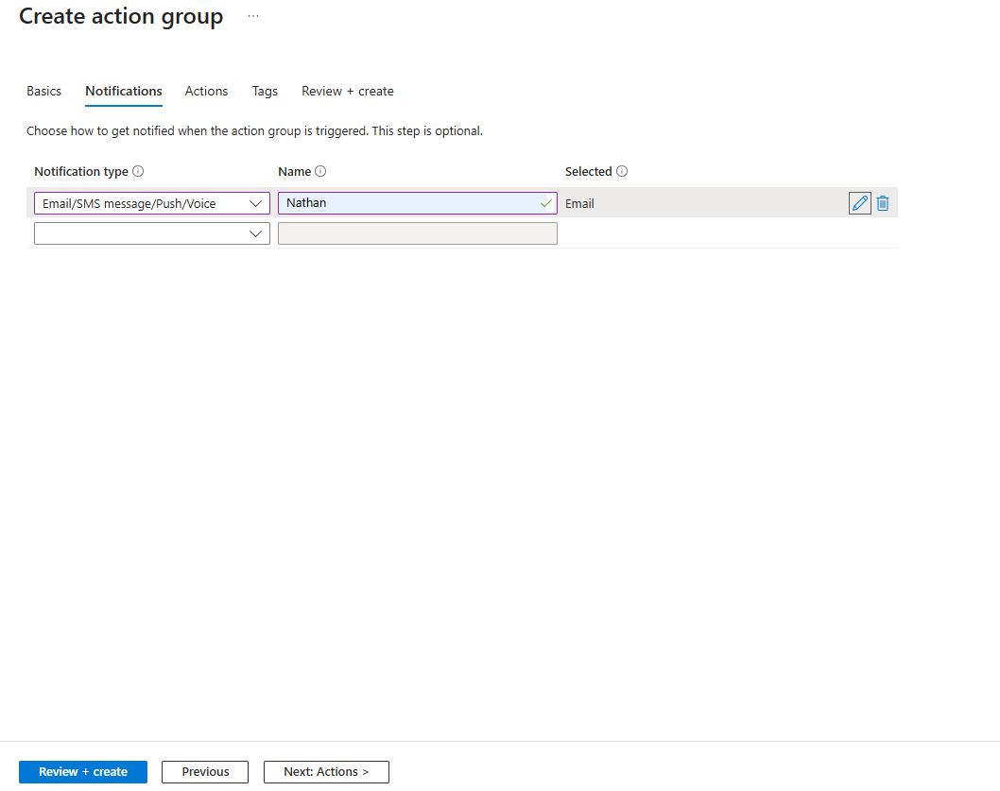
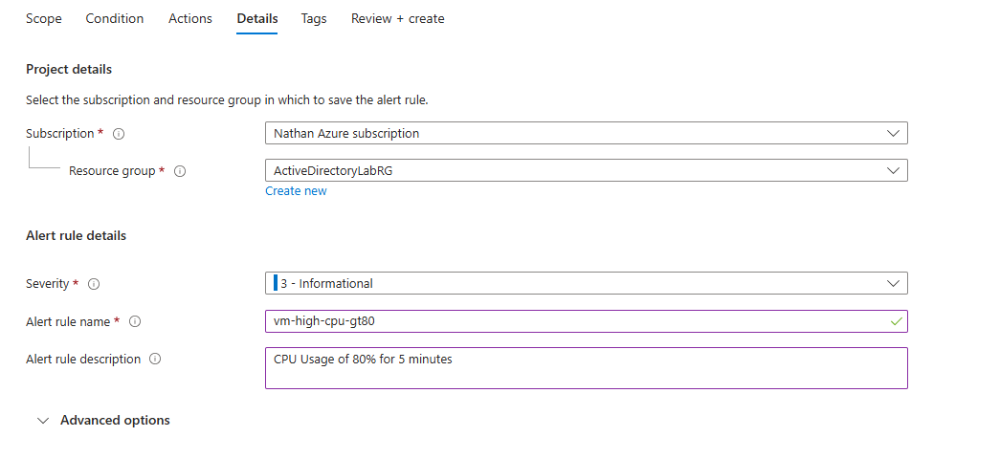
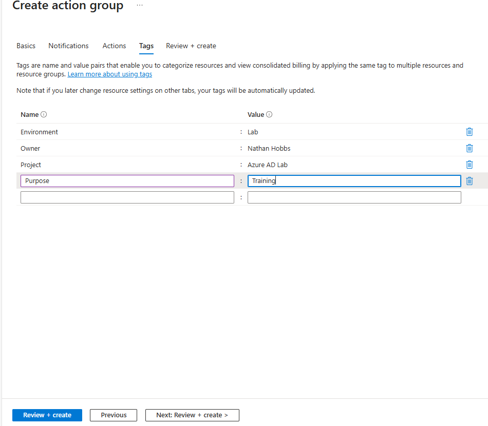
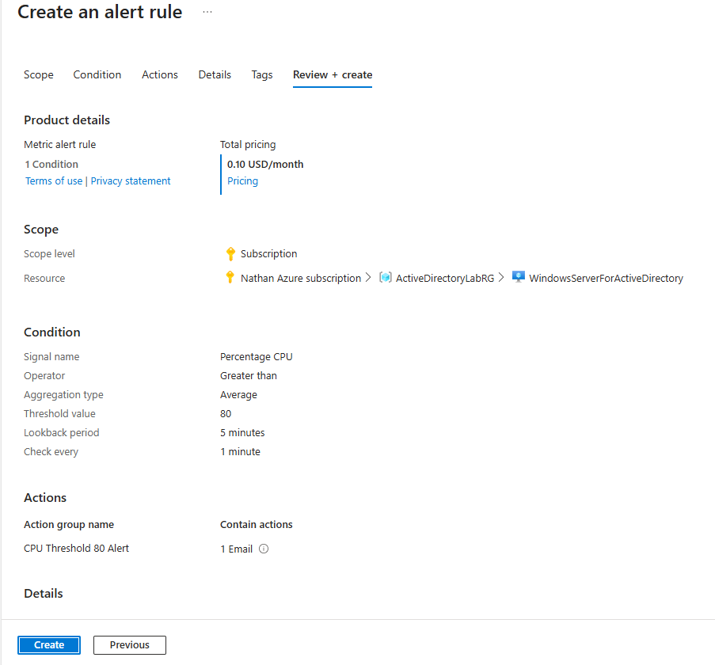
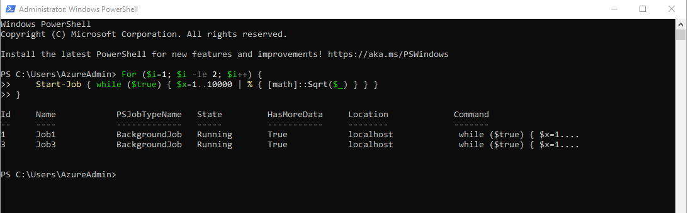
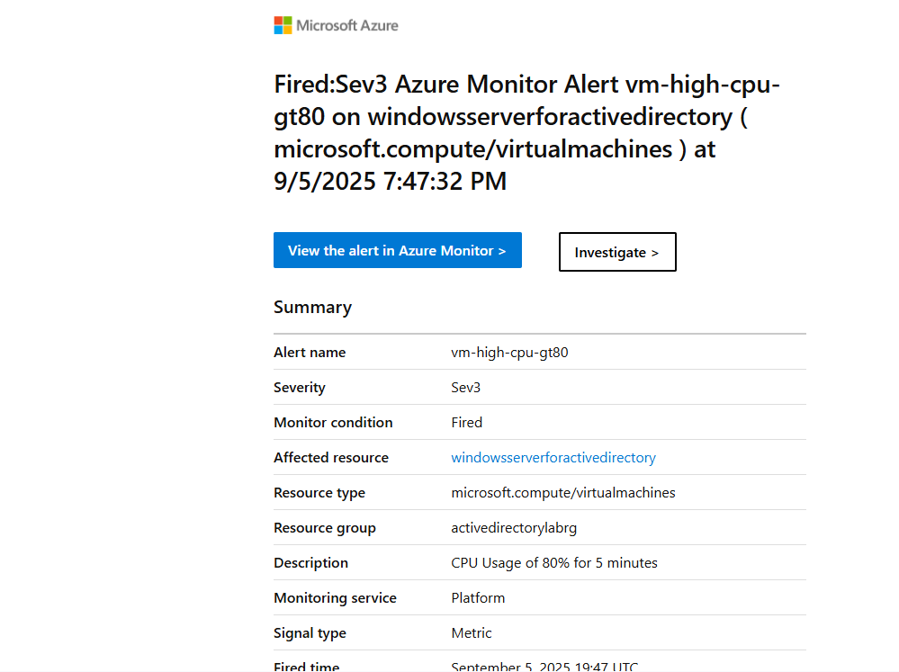

# Azure: Monitor, Backup & Recovery
A lab covering Azure Monitor (Insights, Alerts, Log Analytics), Azure Backup (Recovery Services vault, policies, encryption), and Azure Site Recovery (replication + test failover).

---

_Scenario: A small company needs proactive VM monitoring, daily backups with secure retention, and the ability to fail over to another region if the primary fails._

## Prerequisites:

- 1 x Azure VM (see this repo for more on that: [https://github.com/nahobbs5/AzureActiveDirectoryDemo](https://github.com/nahobbs5/AzureActiveDirectoryDemo)) with the Azure Monitor agent enabled (or enable in this project)
- 1 x Log Analytics workspace (same region as the VM preferred)
- Contributor or higher on the subscription/resource group

## Part 1: The Lab

## Step 1 — Enable Azure Monitor for VMs

1. VM → Monitoring → Insights → Enable (installs/links Azure Monitor Agent to your workspace).

2. VM → Monitoring → Alerts → Create → Alert rule:

```
Signal type: Metric 
Metric: Percentage CPU 
Condition: Greater than 80 for 5 minutes 
Action group: Create one (Email/SMS) and select 
Severity: Sev 2 or Sev 3 
Rule name: vm-high-cpu-gt80
```




<br><br>



<br><br>



<br><br>



<br><br>



<br><br>




3. Trigger it (optional): on the VM, run a quick CPU load and confirm the alert fires to your email.



<br><br>



## Step 2 — Configure Azure Backup (Recovery Services vault)

1. Create vault: Recovery Services vault → Create (name, region, RG).

2. In the vault: Backup → Backup goal → Azure → Virtual machine → Backup.

Backup policy:
- Daily schedule (e.g., 22:00) with 7 days retention (customize as desired).
- Keep Instant Restore defaults or adjust.
  
Security/Encryption:
- Soft delete: Ensure Enabled.
- Immutable vault (preview/feature availability may vary): Enable if available.
- Encryption at rest: Platform‑managed keys (PMK) by default; note if using CMK.

3. Enable backup for the VM → run Backup now → verify Job status = Completed.

Evidence to capture:

Vault overview (Soft delete on)

Backup policy summary

Completed backup job details

Optional restore test: Restore VM (new VM or disk) → verify boot, then clean up to avoid cost.

## Part 2: Final Thoughts

### Cleanup
- To avoid incurring costs, delete the resource group when done:  
  In the Azure Portal, go to **Resource Groups > Select ADLabResourceGroup > Delete resource group**.  
- Alternatively, deallocate the VMs to save costs but keep them for later use.  
- Confirm by typing the resource group name and clicking **Delete**.

### Notes

### Considerations for Future Projects
- experiment further with alert rules for other types of data (e.g. activity log or applicaiton insights)


